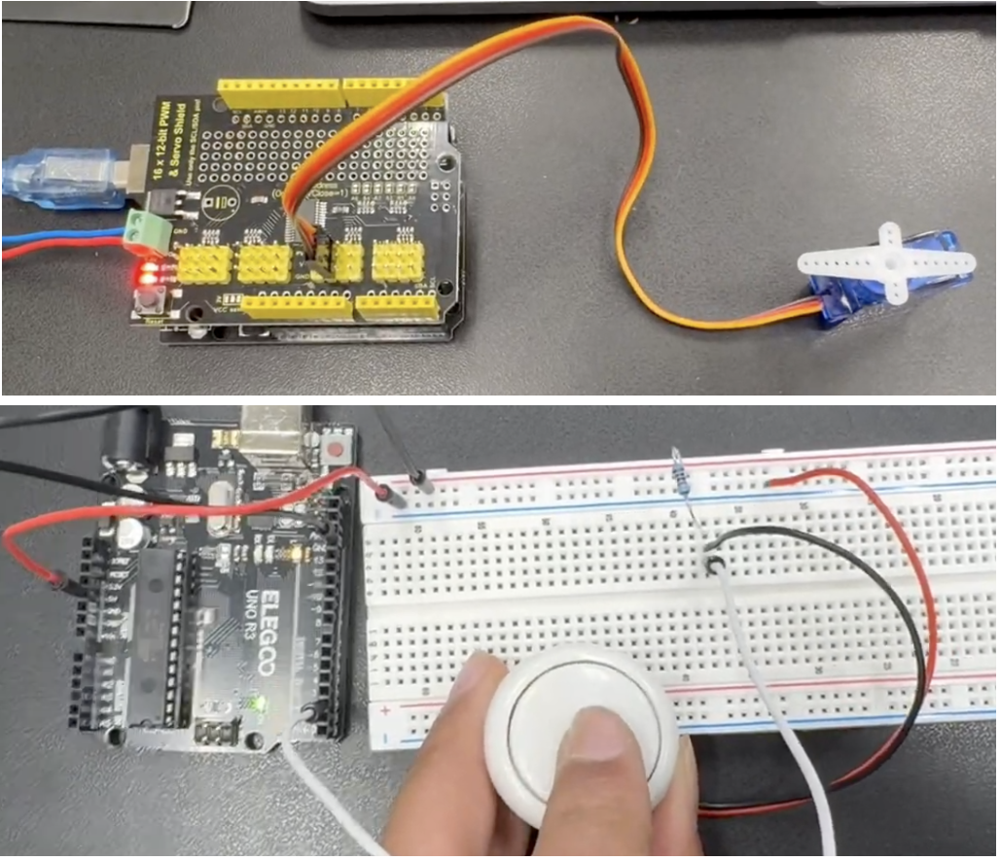
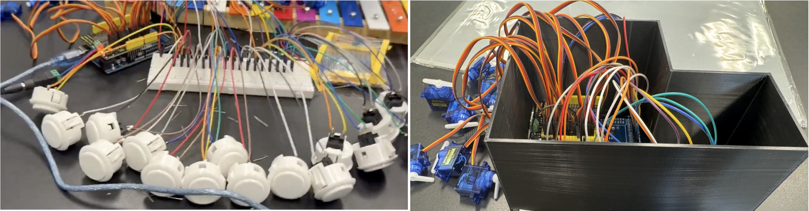
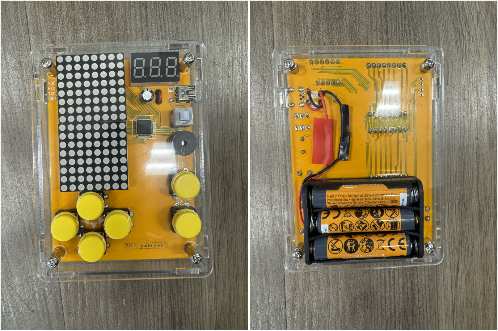

# Marble Music Machine
Last updated: Jun 25 11:19:17

For full documentation visit [this](https://docs.google.com/document/d/19l-sdvGk2wv6FiNkObK4XHLtHroH8l88qlTdeSVrPsI/edit?tab=t.0#heading=h.u3em2oo7d9ti) google document. Because the github can be hard to navigate, this also includes direct links to everything I used - all my libraries, and direct links to each stage in my prototyping. But, if you don't want to do that, I've created one final release that will allow you to simply download everything you need for final assembly.

This is a music machine that replays the notes you input by dropping marbles onto a Xylophone! Rather than playing directly on the xylophone, you pre-program notes by pushing buttons. After you are done, you press the stop button twice (once to stop and once to start playing) then watch as balls are sent bouncing off the keys of the xylophone. This will loop forever because of the ball lift on the side!

```HTML 
Milestones:
Milestone 1: Program button interface to record and store notes.
Milestone 2: Design method for dropping balls onto the xylophone. Design method to control where the balls drop to (to drop on different notes).
Milestone 3: Design conveyor belt to move marbles back to the top for endless replaying!
```

| **Name** | **School** | **Area of Interest** | **Grade** |
|:--:|:--:|:--:|:--:|
| Vikram D | Hillbrook School | Civil and Mechanical Engineering | Incoming Sophomore |

**Replace the BlueStamp logo below with an image of yourself and your completed project. Follow the guide [here](https://tomcam.github.io/least-github-pages/adding-images-github-pages-site.html) if you need help.**


  
# First Milestone

<iframe width="875" height="400" src="https://www.youtube.com/embed/KsqplpovlIQ?si=DtapKUqWkmuTwKQ9" title="YouTube video player" frameborder="0" allow="accelerometer; autoplay; clipboard-write; encrypted-media; gyroscope; picture-in-picture; web-share" referrerpolicy="strict-origin-when-cross-origin" allowfullscreen></iframe>

I planned to build my project in two stages: The coding stage and the design and building stage. During the coding stage, I worked on programming the arduino to receive inputs from a button, and then replay it on a servo. I started with one buttton and one servo. The code was quite simple as I just needed to record one variable: the gap between the button presses. I used an array to store the values. The hardest part of this stage was setting up the servo shield. Because it didn't use the digital or analog pins on the arduino (but instead used channels), I needed to import libraries and set that up. It wasn't hard once I knew what to do, but the troubleshooting was quite annoying. 

Below: My ver simple setup with just one servo and one button. I eventually merged the two together.
<div style="text-align:left"> </div>

However, as I got more buzzers, I had to calculate and store more gaps. I needed more arrays, more wires, and more control over the servos. At the beginning, I just duplicated my code to be able to account for more buttons, and then control the respective servos. The servo shield was very helpful at this point. I thought I was done and was quite satisfied.

However, eventually, I found some limitations. These limitations were because my code was recording each button press in relation to the button press before it and storing the time difference. When played on the servo, each servo would also move in relation to the servo before it. However, the delay timer would start only after the servo before stopped moving. As such, each gap would be the programmed gap from the button <i>and</i> the time it took for the servo to rotate. This meant that the song would be played much slower than programmed. It also meant that I wouldn't be able to play any chords.

My updated solution used something different. Instead of storing each servo press in relation to the servo before it, It would store the servo press in relation to the beginning and create a timeline. Then, when replaying the values on the servo, the arduino would go through the timeline, and whenever it reached a stored event (each button press) it would move the servo. I also changed a function. I changed it from <i>delay</i> to <i>millis</i>. That way the timer would be able to run in parallel to everything else. That way, if there were many stored events at the same time, or extremely close together, the arduino would be able to move all servos at the same time using a macro that I defined. And it worked! The start of the rotation of each servo has the exact same gap as the start of each button press.

Now that this was all done, I started printing a case for my arduino and breadboard, and also added a screen. Below you can see my before and after from before the case to after the case. I still have to add a case for my buttons.
<div style="text-align:left"> </div>

My next steps are to finish enclosing my buttons and to start working on the dispenser mechanism. I did some prototyping while I was waiting for my buttons to arrive, and in between code updates, but now I need to make it more refined. My current prototype is just made out of cardboard. I will move to using acrylic and making 15 channels. I also need to connect my servo to my turning mechanism.

# Second Milestone
Coming soon!
<!--**Don't forget to replace the text below with the embedding for your milestone video. Go to Youtube, click Share -> Embed, and copy and paste the code to replace what's below.**

<iframe width="560" height="315" src="https://www.youtube.com/embed/y3VAmNlER5Y" title="YouTube video player" frameborder="0" allow="accelerometer; autoplay; clipboard-write; encrypted-media; gyroscope; picture-in-picture; web-share" allowfullscreen></iframe>

For your second milestone, explain what you've worked on since your previous milestone. You can highlight:
- Technical details of what you've accomplished and how they contribute to the final goal
- What has been surprising about the project so far
- Previous challenges you faced that you overcame
- What needs to be completed before your final milestone-->

# Final Milestone
Coming soon!
<!--**Don't forget to replace the text below with the embedding for your milestone video. Go to Youtube, click Share -> Embed, and copy and paste the code to replace what's below.**

<iframe width="560" height="315" src="https://www.youtube.com/embed/F7M7imOVGug" title="YouTube video player" frameborder="0" allow="accelerometer; autoplay; clipboard-write; encrypted-media; gyroscope; picture-in-picture; web-share" allowfullscreen></iframe>

For your final milestone, explain the outcome of your project. Key details to include are:
- What you've accomplished since your previous milestone
- What your biggest challenges and triumphs were at BSE
- A summary of key topics you learned about
- What you hope to learn in the future after everything you've learned at BSE -->

# Schematics 
<div style="position: relative; width: 100%; padding-top: calc(max(56.25%, 400px));">
  <iframe src="https://app.cirkitdesigner.com/project/b5c1739f-cfc4-4bea-ba0a-5540df392f83?view=interactive_preview" style="position: absolute; top: 0; left: 0; width: 100%; height: 100%; border: none;"></iframe>
</div> 

# Code
<!--Here's where you'll put your code. The syntax below places it into a block of code. Follow the guide [here]([url](https://www.markdownguide.org/extended-syntax/)) to learn how to customize it to your project needs. -->

```c++
//Code coming soon!
void setup() {
  // put your setup code here, to run once:
  Serial.begin(9600);
  Serial.println("Hello World!");
}

void loop() {
  // put your main code here, to run repeatedly:

}
```

# Bill of Materials
Below are materials! I've seperated it into two parts: For Milestone 1, and for Milestone 2.

**Milestone 1**
| **Part** | **Note** | **Price** | **Link** |
|:--:|:--:|:--:|:--:|
| Arduino Mega 2560 | The brains of the entire operation. | $22 | <a href="https://www.amazon.com/ELEGOO-ATmega2560-ATMEGA16U2-Arduino-Compliant/dp/B01H4ZLZLQ?sr=8-3"> Link </a> |
| Keyestudio 16x12 Servo Shield | To attach servos | $15 | <a href="https://www.amazon.com/KEYESTUDIO-16-Channel-12-bit-Shield-Arduino/dp/B0D3L85YQL?sr=8-1"> Link </a> |
| SANWA 30mm Arcade Buttons (8 Pack White)| These are the buttons I used to program the servos. | $24 (x2) | <a href="https://www.amazon.com/White-Sanwa-Push-Buttons-OBSF-30-W/dp/B003KSB2YC"> Link </a> |
| SANWA 30mm ARcade Buttons (2 Pack Black)| I used 17 buttons. 15 white ones are the keys, these two black ones are the start/stop button and the continuous playback button. | $12 | <a href="https://www.amazon.com/OBSF-30-Arcade-Tournament-Joystick-Compatible/dp/B005BZ10EY"> Link </a> |
| Micro Servos (20 Pack) | These are the servos that I controlled. | $31 | <a href="https://www.amazon.com/Smraza-Helicopter-Airplane-Control-Arduino/dp/B0F32WF12W?sr=8-10"> Link </a>
| IC2 16x12 LCD Display | The display that displayed what the arduino was doing | $9 | <a href="https://www.amazon.com/GeeekPi-Character-Backlight-Raspberry-Electrical/dp/B07S7PJYM6?sr=8-7"> Link </a> |
| 5V Power Adapter 2 Pack | This is what gave power to the arduino and the shield | $10 | <a href="https://www.amazon.com/Power-Adapter-100-240V-Transformers-Supply/dp/B08722QC75?sr=8-3"> Link </a> |
|**Generic Parts:**| Jumper wires, tools for construction (3D printer, filament, wire cutter, jumper wires (MM and MF)|


**Milestone 2**
| **Part** | **Note** | **Price** | **Link** |
|:--:|:--:|:--:|:--:|
| Acrylic 1mm 11x17 Acrylic (4 Pack)|This is the acrylic I used to create the walls for the marble chute. (After the dispenser mechanism)| $17 | <a href="https://www.amazon.com/ELEGOO-ATmega2560-ATMEGA16U2-Arduino-Compliant/dp/B01H4ZLZLQ?sr=8-3"> Link </a> |
| Acrylic 3mm 12x24 Acrylic (2 Pack) |This is the acrylic I used as the baseplate for my marble storage section. (Before the dispenser mechanism)| $24 | <a href="https://www.amazon.com/2-Pack-Clear-Acrylic-Sheet-Plexiglass/dp/B0899QVSY1?sr=8-3"> Link </a> |

# Other Resources/Examples
<!--One of the best parts about Github is that you can view how other people set up their own work. Here are some past BSE portfolios that are awesome examples. You can view how they set up their portfolio, and you can view their index.md files to understand how they implemented different portfolio components.
- [Example 1](https://trashytuber.github.io/YimingJiaBlueStamp/)
- [Example 2](https://sviatil0.github.io/Sviatoslav_BSE/)
- [Example 3](https://arneshkumar.github.io/arneshbluestamp/)-->

To watch the BSE tutorial on how to create a portfolio, click here.

# Starter Project – Retro Arcade Console
<iframe width="875" height="400" src="https://www.youtube.com/embed/-vWqwQfv9GA?si=EgtACB9ZjJk6BhVi" title="YouTube video player" frameborder="0" allow="accelerometer; autoplay; clipboard-write; encrypted-media; gyroscope; picture-in-picture; web-share" referrerpolicy="strict-origin-when-cross-origin" allowfullscreen></iframe>

This console has multiple games on like Snake and Tetris. The parts and code were preloaded and all I needed to do was solder different pieces to the main PCB. It can be powered thorugh a mini-USB port or 3AAA batteries.

<div style="text-align:left"> </div>

This gave me a great way to practice my soldering skills as there were many points I had to solder together. The most challenging part of soldering each contraption while keeping them in place and alligned. The pins were also extremely close together, and I had never had to solder with this much precision before. Attaching the battery was also difficult as I decided to shorten the wire. This meant that I needed to cut the while and re-solder it together. Because I had already attached the wires to the PCB and the battery, soldering them back together was very difficult as I had to position them between the battery and the PCB. I had very little room. However, it turned out great and all the components work!

